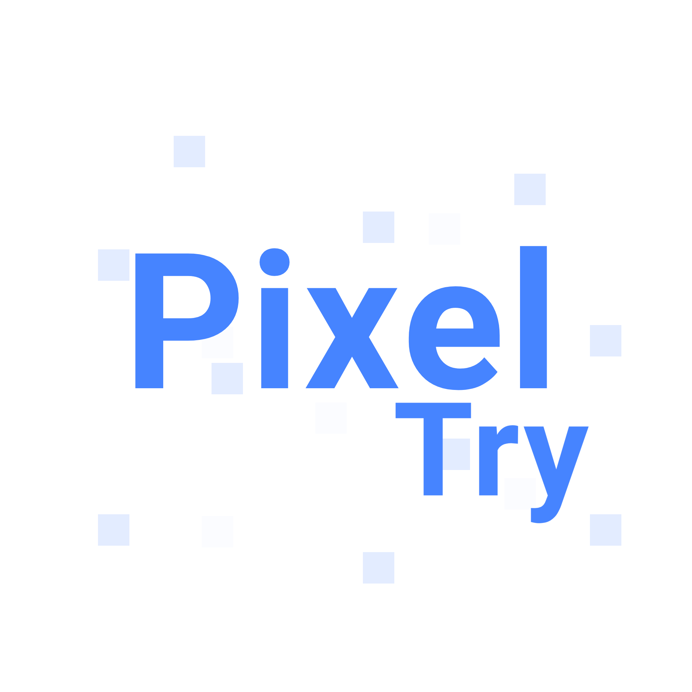

[stars-shield]: https://img.shields.io/github/stars/sennshi/pixeltry.svg?style=for-the-badge
[stars-url]: https://github.com/sennshi/pixeltry/stargazers
[license-shield]: https://img.shields.io/github/license/sennshi/pixeltry.svg?style=for-the-badge
[license-url]: https://github.com/sennshi/pixeltry/blob/master/LICENSE.txt
[repo-size-shield]: https://img.shields.io/github/repo-size/sennshi/pixeltry?style=for-the-badge
[language-count-shield]: https://img.shields.io/github/languages/count/sennshi/pixeltry?style=for-the-badge

<a name="readme-top"></a>

[![Stargazers][stars-shield]][stars-url]
![Repo size][repo-size-shield]
![Language count][language-count-shield]
[![MIT License][license-shield]][license-url]

<br />
<div align="center">
  <a href="https://github.com/github_username/repo_name">
    
  </a>
<h3 align="center">pixel try</h3>
  <p align="center">
    Uma ferramenta simples para criar/desenhar pixel art
    <br /><br />
    <a href="">Ver Demo</a>
  </p>
</div>

## 💻 Pré-requisitos
Realize a instalação do NodeJS pelo link:
- [Node LTS](https://nodejs.org/en/)

Ou instale pelo seu gerenciador de pacotes de sua distro seguindo essas [etapas](https://nodejs.org/en/download/package-manager/).

## 🚀 Instalando 
Para executar o projeto localmente, é necessário clonar-lo em seu ambiente de desenvolvimento:
```
$ git clone https://github.com/sennshi/pixeltry
```
Logo após clonar-lo, acesse a pasta do projeto usando `cd pixeltry` e execute `npm i` para realizar a instalação das bibliotecas necessárias.

## ☕ Usando /Testando o projeto
Após ter realizado a instalação, execute `npm run dev` ou `npm run start` para rodar o projeto,
por fim, basta acessar `http://localhost:3000` para vizualizar a execução do projeto.

### 🖌️ Como usar?
Essas são as ferramentas presentes na `Toolbar` e suas respectivas ações:
| Tool/Botão        | Ação                                                                                    |
|-------------------|-----------------------------------------------------------------------------------------|
| Gotas             | Utilizado para pegar a cor de outro pixel                                               |
| Pincel/Lapis      | Utilizado para desenhar os pixel                                                        |
| Borracha/Apagador | Apaga um pixel                                                                          |
| Grade             | Ativa a grade do canvas(um contorno nos pixeis). Ele auxilia na visualização dos pixeis |
| Lixeira/Sair      | Essa opção apaga o desenho e lhe redireciona para o menu(seleção de resolução/tamanho)  |
| Fullscreen        | Ativa o modo tela cheia                                                                 |

## 🛠️ Construído com

[react-badge]: https://img.shields.io/badge/React-20232A?style=for-the-badge&logo=react&logoColor=61DAFB
[sass-badge]: https://img.shields.io/badge/Sass-CC6699?style=for-the-badge&logo=sass&logoColor=white
[javascript-badge]: https://img.shields.io/badge/JavaScript-F7DF1E?style=for-the-badge&logo=javascript&logoColor=black

* [![React][react-badge]](https://reactjs.org/)
* ![Javascript][javascript-badge] 
* [![Sass][sass-badge]](https://sass-lang.com/)

## 📝 Licença

Esse projeto está sob licença. Veja o arquivo [LICENÇA](LICENSE) para mais detalhes.

## ⚙️ Ferramentas & Bibliotecas 
Foram utilizados as seguintes ferramentas e bibliotecas no desenvolvimento do projeto:
* [react-prismazoom](https://github.com/sylvaindubus/react-prismazoom) - utilizado para manipular a distância de visualização do canvas.
* [react-component-export-image](https://github.com/im-salman/react-component-export-image) - exportação do componente canvas como imagem.
* [react-icons](https://github.com/react-icons/react-icons) - ícones
* [react-color](https://github.com/casesandberg/react-color) - color picker (SketchPicker)
* [favicon.io](https://favicon.io/) - usado para gerar o favicon

## 🌱 Referência utilizada
- [How to build a Pixel Art Drawing App in React](https://aleksandarpopovic.com/How-to-build-a-Pixel-Art-Drawing-App-in-React/)

<div align="right">
  <a href="#readme-top">⬆ Voltar ao topo</a><br>
</div>

---

<div align="center">
  <p>feito com ❤️ por <a href="https://github.com/sennshi">Rodrigo sennshi</a></p>
</div>
